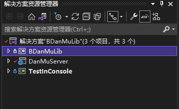

# bilibili 弹幕工具

- 效果图

> 2022/4/25 16:10 B站dota2主播阿夏夏和水友battle后

游戏是我本机测试的效果

浏览器是实时直播弹幕

### 后端源码

- 解决方案 

- **BDanMuLib** 为核心库,处理tcp连接B站弹幕服务器,解析msg内容,整个实现大概600行代码

- **DanmMuServer** 是dotnetcore signalR服务器,实现和前端即时通讯
	- 目前只对前端输出以下内容
	  

- **TestInConsole** 测试核心库的输出内容

### 前端UI实现 

> 代码在根目录下的**danmu-tool**

- 简单使用vue2做数据的映射
- @microsoft/signalR 即时通讯库
- electron实现全屏界面,鼠标穿透

### 全屏窗口无边框csgo

### 还没有完善的

- [ ] electron打包白屏
- [ ] 前端后打包安装(electron.net ?)
- [ ] 房间号配置和弹幕显示位置自定义

# 注意点

- 不能在全屏独占模式下使用
- 对吃cpu的游戏,可以将signalR部署到服务器上